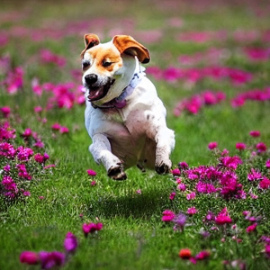
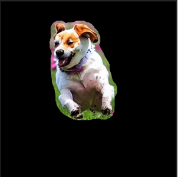
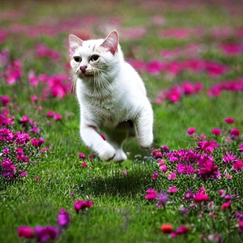
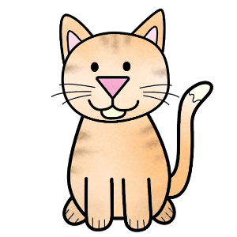
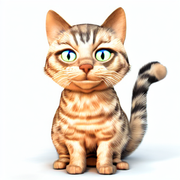
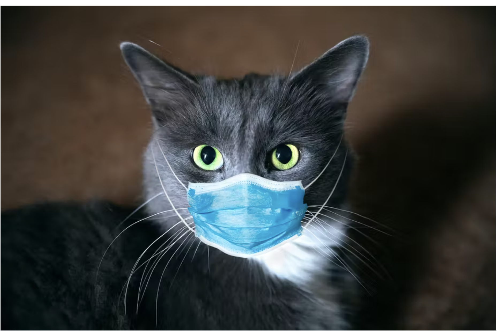
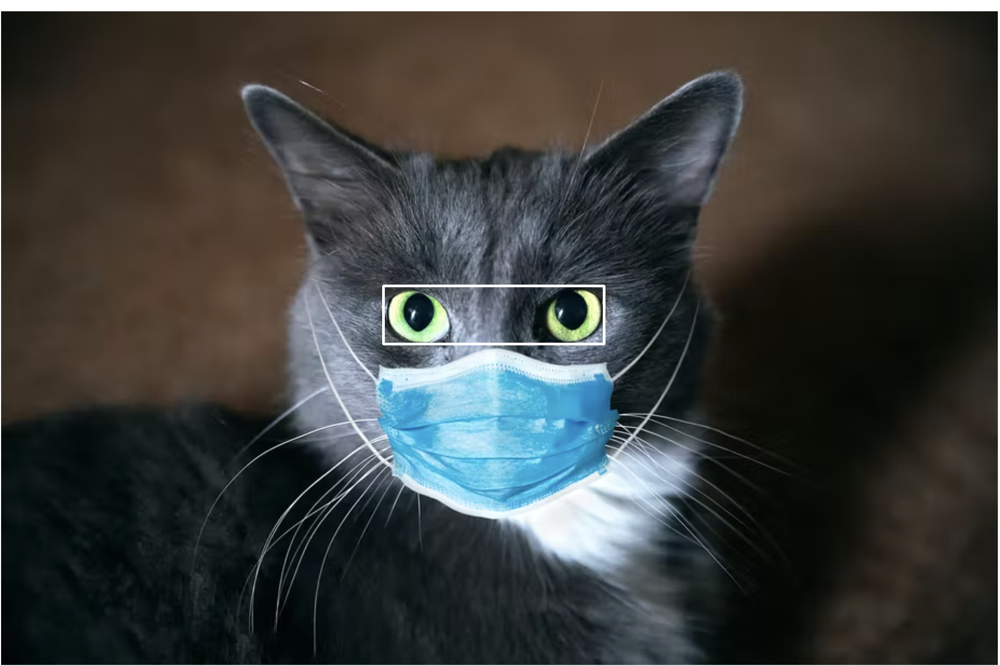
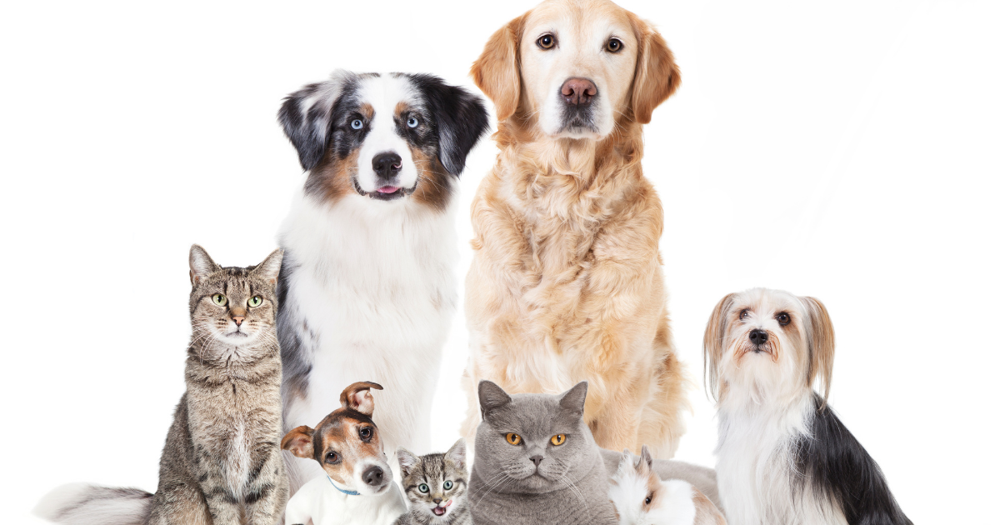
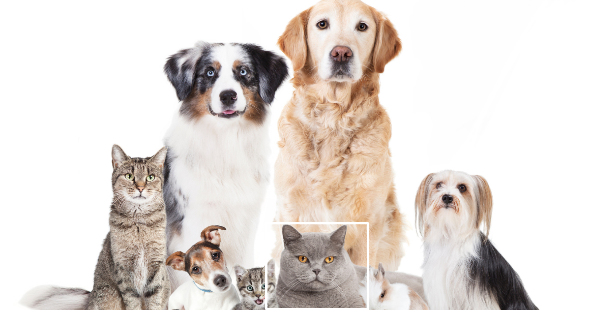

# Image Based Transformer Tasks

This repository contains a set of example projects for image related transformers tasks using Amazon SageMaker.  This includes the following tasks:
  * text-to-image-custom-container:  Generate an image from a text prompt.  Deploy using a custom Docker container on SageMaker.
  * image-to-image-custom-container: Generate an image from a starting image and text prompt.  Deploy using a custom Docker container on SageMaker.
  * image-inpainting-custom-container:  Alter a portion of an image according to a text prompt and image mask.  Deploy using a custom Docker container.  (Work in progress)
  * cross-modality-container-ofa:  Generate a caption to describe an image ,answer a specific question about an image, and generate a border around the specific object in an image

To see the example project for each task above, take a look at the corresponding directory in this repository with the same name.

Many of the models in this repository use the Stable Diffusion algorithm.  From [Wikipedia](https://en.wikipedia.org/wiki/Stable_Diffusion): "Stable Diffusion is a machine learning, text-to-image model developed by StabilityAI, in collaboration with EleutherAI and LAION, to generate digital images from natural language descriptions. The model can be used for other tasks too, like generating image-to-image translations guided by a text prompt.  Stable Diffusion was trained on a subset of the LAION-Aesthetics V2 dataset. It was trained using 256 Nvidia A100 GPUs at a cost of $600,000."

## Examples

Here is an example of each task, so that you can get an idea of what each one does.

### Text to Image
#### Prompt:  A dog running in a field of flowers.

### Image Inpainting
First, manually create a mask to focus the algorithm on a part of an image.  The blacked out part of the image is frozen, and will not be changed by the algoritm.  Here, we want to keep the background, but swap out the dog.

  

#### Prompt:  A cat running in a field of flowers.

### Image to Image
Here, we start with a simplistic cat drawing, and we want to enhance the image according to the prompt.

#### Prompt: 3D render, highly detailed, cat!

  

### OFA cross modality model  

#### Visual QA & Image Grounding 

#####  A cat with a mask
  

 **Prompt:** what does the image describe?
 **Model:** a cat wearing a face mask

 **Prompt:** What is the cat wearing?
 **Model:** Mask

  **Prompt:** which region does the text " eyes " describe?
  **Model:**  

#####  Cat & Dog portrait
 

 **Prompt:** what does the image describe?
 **Model:** portrait of a group of pets, cats and dogs 

 **Prompt:** What is the color of the cat?
 **Model:** gray

 **Prompt:** What is the color of the largest dog?
 **Model:** brown

 **Prompt:**  which region does the text " cat " describe?
 **Model:**  

## References
  * [Stable Diffusion Model on Hugging Face](https://huggingface.co/CompVis/stable-diffusion-v1-4)
  * [Custom container packaging code example](https://github.com/RamVegiraju/SageMaker-Deployment/tree/master/RealTime/BYOC/PreTrained-Examples/SpacyNER)

## Security

See [CONTRIBUTING](CONTRIBUTING.md#security-issue-notifications) for more information.

## License

This library is licensed under the MIT-0 License. See the LICENSE file.

